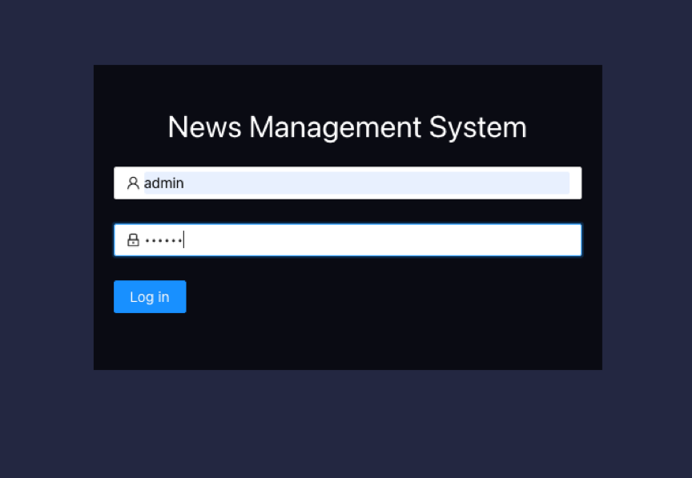
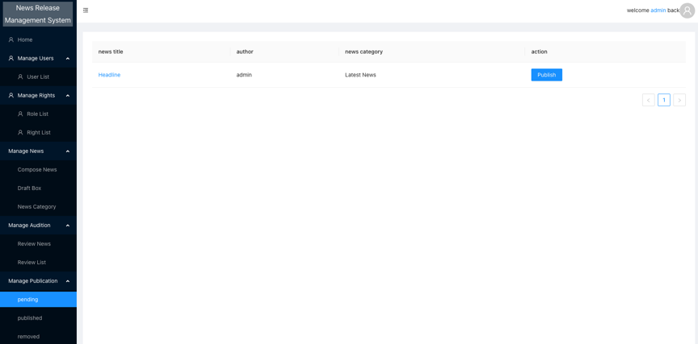

This project is a web-based application (SPA) designed for managing online news. 
It comprises several sub-modules, including login, permission management, user management, news publication, and news data analysis. 
The project uses modern front-end technologies such as react hooks, react redux, and Antd.

How to start the project:
🚀 Quick start

1. npm install

  install dependency the project needs

2. cd /db

  navigate into database's folder

3. npm install -g json-server

  install JSON Server

4. json-server --watch db.json -port 3000

  Start JSON Server

5. cd ../

  navigate into project folder

6. npm run start

  Runs the app and open it to view in the browser.

Login Page  Account: Admin Password:123456

Home Page

Add users 

Change permission

Compose News 

Draft Box 

Review News

Publish News 

Appaering on home page

